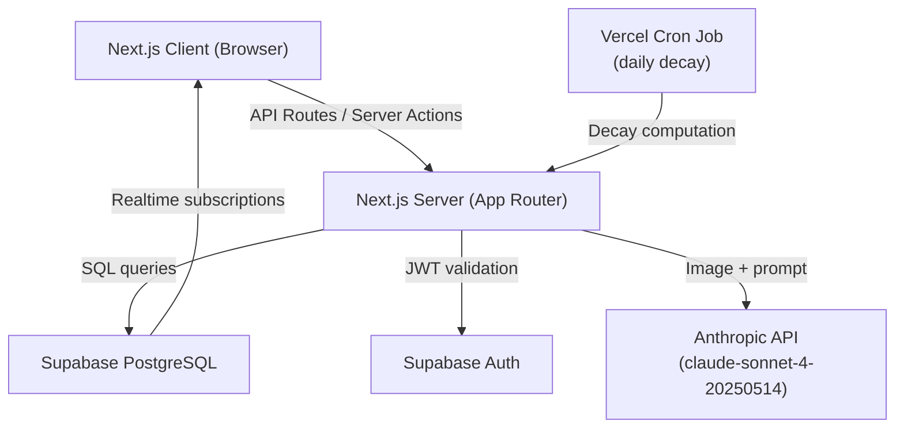
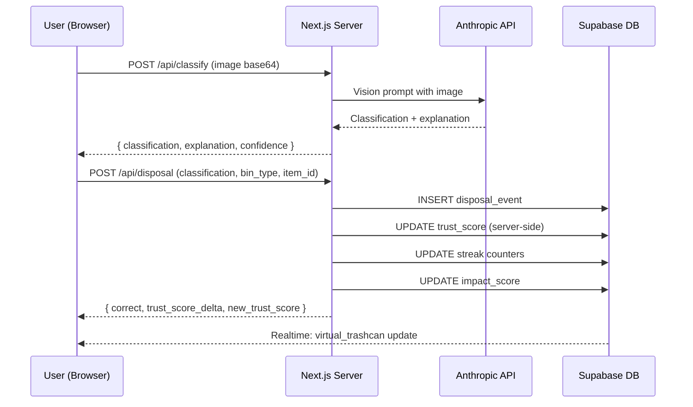

# Design Document: Trustbin

## Overview

Trustbin is a gamified sustainability web application built with Next.js that incentivizes correct waste disposal through AI-assisted classification, a trust-based verification system, and competitive leaderboard mechanics scoped to the ASU community.

The core loop is: scan an item → AI classifies it → user selects the bin they used → system records the disposal event and updates trust score, streak, leaderboard, and impact metrics. Users who demonstrate consistent correct behavior unlock a frictionless "tap-to-log" mode. A quiz system reinforces learning using images of items the user has actually scanned, and an animated virtual trashcan provides a playful visual history.

### Key Design Decisions

- **Next.js App Router** with server components for data fetching and client components for interactive UI (camera, animations, real-time updates)
- **Supabase** for auth (email/password), PostgreSQL database, and real-time subscriptions
- **Anthropic claude-sonnet-4-20250514** for both AI image classification and quiz question generation
- **Framer Motion** for virtual trashcan animations and drop effects
- **Server-side trust score computation** to prevent client-side manipulation
- **Scheduled background job** (Vercel Cron) for daily trust score decay

---

## Architecture



### Request Flow: Disposal Event



---

## Components and Interfaces

### Page Structure (App Router)

```
app/
  (auth)/
    login/page.tsx
    register/page.tsx
  (app)/
    layout.tsx              # authenticated shell
    dashboard/page.tsx      # home with scan CTA
    scan/page.tsx           # camera + classification flow
    trashcan/page.tsx       # virtual trashcan
    quiz/page.tsx           # quiz interface
    leaderboard/page.tsx    # ASU leaderboard
    profile/page.tsx        # trust score, streak, impact
  api/
    classify/route.ts       # POST: image → classification
    disposal/route.ts       # POST: log disposal event
    quiz/generate/route.ts  # POST: generate quiz question
    quiz/answer/route.ts    # POST: submit quiz answer
    flag/route.ts           # POST: submit flag
    admin/
      flags/route.ts        # GET/PATCH: admin flag review
```

### Client Components

| Component | Responsibility |
|---|---|
| `CameraCapture` | Access device camera, capture image, send to classify API |
| `ClassificationResult` | Display AI result, explanation, confidence, flag button |
| `BinSelector` | Three-button UI for selecting Trash / Recycling / Compost |
| `DisposalFeedback` | Animated correct/incorrect feedback after bin selection |
| `VirtualTrashcan` | Suika-style physics bin with Matter.js, drag-to-rearrange items |
| `ItemIcon` | Individual item icon with tap-to-detail behavior |
| `DropAnimation` | Physics-based drop animation for items entering the bin |
| `TrustScoreBar` | Progress bar toward Trust_Threshold (100pts) |
| `StreakDisplay` | Current daily streak count + today's status |
| `ImpactCard` | Impact_Score with concrete equivalency text |
| `QuizCard` | Image + 4-choice question UI |
| `Leaderboard` | Ranked list with scores and period label |
| `NearbyResources` | Water fountain / e-waste location display |
| `ShareProfileButton` | Share profile via Web Share API or clipboard |
| `LoadingTip` | Contextual sustainability tip during loading states |
| `QuizPageClient` | Quiz session manager with daily limit tracking |

### Server Actions / API Routes

| Route | Method | Auth | Description |
|---|---|---|---|
| `/api/classify` | POST | Required | Sends image to Anthropic, returns classification |
| `/api/disposal` | POST | Required | Records disposal event, updates all scores |
| `/api/quiz/generate` | POST | Required | Generates quiz question via Anthropic |
| `/api/quiz/answer` | POST | Required | Validates answer, updates leaderboard score |
| `/api/flag` | POST | Required | Submits a flag on a classification |
| `/api/admin/flags` | GET/PATCH | Admin | Lists and resolves flags |
| `/api/cron/decay` | POST | Cron secret | Applies daily trust score decay |

---

## Data Models

### Users (extends Supabase Auth)

```sql
CREATE TABLE user_profiles (
  id            UUID PRIMARY KEY REFERENCES auth.users(id),
  email         TEXT NOT NULL,
  display_name  TEXT,
  trust_score   INTEGER NOT NULL DEFAULT 0 CHECK (trust_score >= 0),
  streak_weeks  INTEGER NOT NULL DEFAULT 0,
  current_week_correct INTEGER NOT NULL DEFAULT 0,
  last_disposal_at TIMESTAMPTZ,
  leaderboard_score INTEGER NOT NULL DEFAULT 0,
  impact_score  NUMERIC(10,2) NOT NULL DEFAULT 0,
  is_admin      BOOLEAN NOT NULL DEFAULT FALSE,
  flag_active   BOOLEAN NOT NULL DEFAULT FALSE,
  created_at    TIMESTAMPTZ NOT NULL DEFAULT NOW()
);
```

### Disposal Events

```sql
CREATE TABLE disposal_events (
  id              UUID PRIMARY KEY DEFAULT gen_random_uuid(),
  user_id         UUID NOT NULL REFERENCES user_profiles(id),
  item_description TEXT NOT NULL,
  material_type   TEXT,
  ai_classification TEXT NOT NULL CHECK (ai_classification IN ('Trash','Recycling','Compost')),
  selected_bin    TEXT NOT NULL CHECK (selected_bin IN ('Trash','Recycling','Compost')),
  is_correct      BOOLEAN NOT NULL,
  image_url       TEXT,
  trust_delta     INTEGER NOT NULL DEFAULT 0,
  flagged         BOOLEAN NOT NULL DEFAULT FALSE,
  created_at      TIMESTAMPTZ NOT NULL DEFAULT NOW()
);

CREATE INDEX idx_disposal_user_created ON disposal_events(user_id, created_at DESC);
CREATE INDEX idx_disposal_abuse_check ON disposal_events(user_id, ai_classification, created_at);
```

### Flags

```sql
CREATE TABLE flags (
  id              UUID PRIMARY KEY DEFAULT gen_random_uuid(),
  disposal_event_id UUID NOT NULL REFERENCES disposal_events(id),
  user_id         UUID NOT NULL REFERENCES user_profiles(id),
  reason          TEXT,
  status          TEXT NOT NULL DEFAULT 'pending' CHECK (status IN ('pending','resolved_valid','resolved_invalid')),
  admin_note      TEXT,
  created_at      TIMESTAMPTZ NOT NULL DEFAULT NOW(),
  resolved_at     TIMESTAMPTZ
);
```

### Quiz Questions

```sql
CREATE TABLE quiz_questions (
  id              UUID PRIMARY KEY DEFAULT gen_random_uuid(),
  user_id         UUID NOT NULL REFERENCES user_profiles(id),
  disposal_event_id UUID REFERENCES disposal_events(id),
  question_text   TEXT NOT NULL,
  image_url       TEXT,
  choices         JSONB NOT NULL,  -- ["Trash","Recycling","Compost","None of the above"]
  correct_answer  TEXT NOT NULL,
  explanation     TEXT NOT NULL,
  answered        BOOLEAN NOT NULL DEFAULT FALSE,
  answered_correctly BOOLEAN,
  created_at      TIMESTAMPTZ NOT NULL DEFAULT NOW()
);
```

### Leaderboard Periods

```sql
CREATE TABLE leaderboard_periods (
  id              UUID PRIMARY KEY DEFAULT gen_random_uuid(),
  period_label    TEXT NOT NULL,  -- e.g. "Week of Jan 6, 2025"
  starts_at       TIMESTAMPTZ NOT NULL,
  ends_at         TIMESTAMPTZ NOT NULL
);

CREATE TABLE leaderboard_entries (
  id              UUID PRIMARY KEY DEFAULT gen_random_uuid(),
  period_id       UUID NOT NULL REFERENCES leaderboard_periods(id),
  user_id         UUID NOT NULL REFERENCES user_profiles(id),
  score           INTEGER NOT NULL DEFAULT 0,
  qualified       BOOLEAN NOT NULL DEFAULT FALSE,  -- met Weekly_Minimum
  UNIQUE(period_id, user_id)
);
```

### Static ASU Campus Resources

```typescript
// Loaded at build time from /data/asu-resources.json
interface AsuResource {
  id: string;
  type: 'water_fountain' | 'ewaste_dropoff';
  name: string;
  building: string;
  zone: string;
  coordinates?: { lat: number; lng: number };
  notes?: string;
}
```

### Trust Score Computation (Server-Side)

The trust score is always computed server-side in a database transaction to prevent race conditions:

```typescript
// Pseudocode for disposal event processing
async function processDisposalEvent(userId, disposalData) {
  return await db.transaction(async (tx) => {
    const profile = await tx.getUserProfile(userId, { forUpdate: true });
    
    // Abuse check: >20 identical classifications in 24hrs
    const recentCount = await tx.countRecentIdentical(userId, disposalData.classification, 24);
    if (recentCount > 20) {
      await tx.setFlagActive(userId, true);
      await tx.insertFlag({ userId, type: 'abuse', autoGenerated: true });
      return { blocked: true, reason: 'abuse_threshold' };
    }
    
    const isCorrect = disposalData.selectedBin === disposalData.classification;
    let trustDelta = 0;
    
    if (isCorrect && !profile.flagActive) {
      trustDelta = 10;
      if (profile.streakWeeks >= 2) trustDelta += 2; // streak bonus
    }
    
    const newTrustScore = Math.max(0, profile.trustScore + trustDelta);
    
    await tx.insertDisposalEvent({ ...disposalData, isCorrect, trustDelta });
    await tx.updateProfile(userId, {
      trustScore: newTrustScore,
      lastDisposalAt: new Date(),
      currentWeekCorrect: isCorrect ? profile.currentWeekCorrect + 1 : profile.currentWeekCorrect,
    });
    
    return { isCorrect, trustDelta, newTrustScore };
  });
}
```

### Trust Score Decay (Cron Job)

```typescript
// Runs daily via Vercel Cron at midnight UTC
async function applyTrustDecay() {
  const cutoff = subDays(new Date(), 14);
  const inactiveUsers = await db.query(`
    SELECT id, trust_score, last_disposal_at
    FROM user_profiles
    WHERE last_disposal_at < $1 AND trust_score > 0
  `, [cutoff]);
  
  for (const user of inactiveUsers) {
    const daysInactive = differenceInDays(new Date(), user.lastDisposalAt) - 14;
    const decay = Math.min(daysInactive * 5, user.trustScore);
    await db.updateTrustScore(user.id, user.trustScore - decay);
  }
}
```

### Impact Score Calculation

Impact score is calculated per disposal event based on material type and classification:

```typescript
const IMPACT_WEIGHTS: Record<string, { unit: string; weight: number }> = {
  'aluminum_can':    { unit: 'aluminum cans recycled', weight: 1.0 },
  'plastic_bottle':  { unit: 'plastic bottles recycled', weight: 0.8 },
  'cardboard':       { unit: 'lbs of cardboard diverted', weight: 0.5 },
  'food_waste':      { unit: 'lbs of compost diverted', weight: 0.3 },
  // ... more material types
};

// Trash disposals do NOT earn impact score (Requirement 10.4)
function computeImpactDelta(classification: string, materialType: string): number {
  if (classification === 'Trash') return 0;
  return IMPACT_WEIGHTS[materialType]?.weight ?? 0.1;
}
```

---

## Correctness Properties

*A property is a characteristic or behavior that should hold true across all valid executions of a system — essentially, a formal statement about what the system should do. Properties serve as the bridge between human-readable specifications and machine-verifiable correctness guarantees.*

### Property 1: Trust score never goes below zero

*For any* user profile and any sequence of disposal events and decay operations, the trust score SHALL always remain greater than or equal to zero.

**Validates: Requirements 4.6**

### Property 2: Correct disposal increments trust score by expected amount

*For any* user without an active flag, logging a correct disposal event (selected bin matches AI classification) SHALL increment the trust score by exactly 10 points, plus 2 additional points if the user's streak is 2 or more weeks.

**Validates: Requirements 4.2, 4.3**

### Property 3: Abuse threshold blocks trust score increments

*For any* user who has logged more than 20 identical item classifications within a 24-hour window, subsequent correct disposal events SHALL NOT increment the trust score until the flag is resolved.

**Validates: Requirements 4.7, 10.1**

### Property 4: Trust threshold unlocks tap-to-log

*For any* user whose trust score is at or above 100, the photo verification requirement SHALL be absent from the disposal flow. *For any* user whose trust score is below 100, photo verification SHALL be required.

**Validates: Requirements 4.4, 4.5**

### Property 5: Weekly minimum gates leaderboard qualification

*For any* leaderboard period, a user who has not logged at least 3 correct disposal events in that calendar week SHALL NOT appear in the leaderboard rankings for that period.

**Validates: Requirements 6.4, 6.5, 10.2**

### Property 6: Streak increments only when daily minimum is met

*For any* user, at the end of a day, the streak count SHALL increment by exactly 1 if the user logged at least 1 correct disposal event that day. If the minimum was not met and the day is not an ASU holiday, the streak SHALL reset to 0. On ASU holidays, the streak SHALL be preserved unchanged.

**Validates: Requirements 5.2, 5.3, 5.4**

### Property 7: Quiz question round-trip integrity

*For any* quiz question generated from a disposal event, the question object SHALL contain a non-empty question string, exactly four answer choices, a correct answer that is one of the four choices, and a non-empty explanation.

**Validates: Requirements 6.8**

### Property 8: Trash disposals earn no impact score

*For any* disposal event where the AI classification is Trash and the selected bin is Trash, the impact score delta SHALL be exactly 0.

**Validates: Requirements 10.4**

### Property 9: Decay does not exceed current trust score

*For any* user with an inactive account, applying trust score decay SHALL reduce the score by at most the current trust score value (i.e., the score cannot go negative from decay).

**Validates: Requirements 4.6**

> Note: Property 9 is a more specific formulation of Property 1 focused on the decay path. Property 1 covers the general invariant; Property 9 validates the decay computation specifically.

### Property 10: Flag suspends trust score penalization

*For any* disposal event with an active flag, the trust score SHALL NOT be decremented for that event until the flag is resolved by an Admin.

**Validates: Requirements 4.8, 2.4**

---

## Error Handling

### AI Classification Errors

- **Low confidence**: If Anthropic returns a classification with confidence below threshold (or signals uncertainty), the app displays a "couldn't determine" state and prompts the user to retake the photo or manually select a classification.
- **API timeout / 5xx**: Retry once with exponential backoff (500ms). On second failure, surface an error toast and allow manual classification selection.
- **Image too large / unsupported format**: Client-side validation before upload; reject with user-friendly message.

### Authentication Errors

- **Duplicate email on registration**: Surface Supabase's unique constraint error as "This email is already registered."
- **Invalid credentials on login**: Generic "Invalid email or password" message (no enumeration).
- **Session expiry**: Middleware redirects to `/login` with `?redirect` param to return after re-auth.

### Disposal Event Errors

- **Concurrent abuse detection race**: Handled by `SELECT ... FOR UPDATE` in the transaction to prevent double-counting.
- **Database write failure**: Return 500 with retry guidance; do not partially update scores.

### Cron Decay Errors

- **Cron job failure**: Log to Vercel logs; decay is idempotent (re-running applies correct delta based on current `last_disposal_at`).
- **User with null `last_disposal_at`**: Skip decay (new user with no events).

### Flag Errors

- **Duplicate flag on same disposal event**: Return 409 with "You've already flagged this item."
- **Flag on non-existent disposal event**: Return 404.

---

## Testing Strategy

### Unit Tests (Vitest)

Focus on pure business logic functions:

- `computeTrustDelta(profile, disposalEvent)` — correct/incorrect, streak bonus, flag active
- `computeImpactDelta(classification, materialType)` — all classification/material combinations
- `isAbuseThresholdExceeded(recentCount)` — boundary at 20
- `computeDecay(lastDisposalAt, currentTrustScore)` — 14-day grace, per-day decay, floor at 0
- `isLeaderboardQualified(weeklyCorrectCount)` — boundary at 3
- `isStreakMaintained(weeklyCorrectCount)` — boundary at 3
- `validateQuizQuestion(question)` — structural validation of LLM output

### Property-Based Tests (fast-check)

Each property test runs a minimum of 100 iterations.

**Tag format: `Feature: trustbin, Property {N}: {property_text}`**

- **Property 1 & 9**: Generate arbitrary sequences of trust score mutations (correct disposal, incorrect disposal, decay steps) and assert score never goes below 0.
- **Property 2**: Generate user profiles (varying streak weeks) and correct disposal events; assert trust delta equals 10 + (streak >= 2 ? 2 : 0).
- **Property 3**: Generate users with >20 identical classifications in 24hrs; assert trust increment is blocked.
- **Property 4**: Generate trust scores around the 100-point threshold; assert tap-to-log availability matches `score >= 100`.
- **Property 5 & 6**: Generate daily disposal counts; assert leaderboard qualification matches the 3-event weekly minimum rule, and daily streak behavior matches the 1-event daily minimum with holiday preservation.
- **Property 7**: Generate disposal events and call quiz question validator; assert structural completeness of generated questions.
- **Property 8**: Generate disposal events with Trash classification; assert impact delta is always 0.
- **Property 10**: Generate flagged disposal events; assert no trust score decrement is applied.

### Integration Tests

- Auth flow: register → login → logout → session expiry redirect
- Full disposal flow: image upload → classification → bin selection → score updates
- Abuse detection: 21 identical classifications in 24hrs triggers flag
- Cron decay: simulate 15+ days of inactivity, verify decay applied correctly
- Quiz generation: verify Anthropic API call structure and response parsing
- Leaderboard: verify only qualified users appear

### Snapshot / Visual Tests

- Virtual trashcan renders physics bin with items inside
- Item icons appear in bin after disposal event with correct color coding
- Impact card displays correct equivalency text for known material types

---

## Virtual Trashcan: Suika-Style Physics Design

### Overview

The Virtual Trashcan is reimagined as a Suika game-inspired physics bin. Items are circular bodies inside a transparent container, subject to gravity and collision. Users can drag items to rearrange them. Filter buttons let users view all items or filter by classification.

### Technology

- **Matter.js** — 2D physics engine for gravity, collisions, constraints, and mouse/touch interaction
- **HTML5 Canvas** — rendering layer for smooth 60fps physics visualization
- **Supabase Realtime** — live updates when new disposal events are recorded

### Physics Configuration

```typescript
const PHYSICS_CONFIG = {
  gravity: { x: 0, y: 1.0 },
  itemRestitution: 0.3,    // bounciness
  itemFriction: 0.1,
  itemDensity: 0.001,
  wallThickness: 20,
  binWidth: 350,            // pixels
  binHeight: 500,           // pixels
};
```

### Item Representation

Each disposal event becomes a circular physics body:
- **Radius**: 15–30px based on material type (larger items = bigger circles)
- **Color**: Gray (Landfill), Blue (Recycling), Green (Compost)
- **Label**: Item emoji or first letter of description
- **On tap**: Opens detail modal with classification, date, material type, educational tip

### Interaction Model

1. **Gravity**: Items fall and settle at the bottom of the bin
2. **Collision**: Items push each other when they collide
3. **Drag**: Mouse/touch drag moves an item, displacing others physically
4. **Drop animation**: New items appear at the top and fall in with bounce
5. **Filter**: Switching filter removes/adds physics bodies with fade animation

### Filter Buttons

```
[ All ] [ 🗑️ Landfill ] [ ♻️ Recycling ] [ 🌱 Compost ]
```

Default: "All" shows every item. Selecting a filter removes non-matching items from the physics world and fades them out.

### Performance Constraints

- Maximum 50 physics bodies rendered at once (older items become static or are paginated)
- Canvas resolution capped at device pixel ratio × 1 for mobile performance
- Physics simulation paused when the trashcan page is not visible (Page Visibility API)
